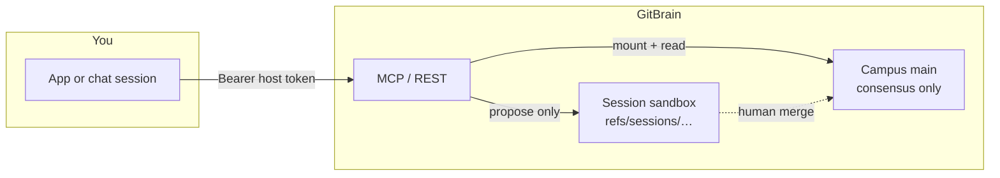

# GitBrain adopt kit

**Turnkey** ways to use [GitBrain](https://gitbrain.com) ([kit repo](https://github.com/gitbrainlab/gitbrain-adopt)) as durable knowledge for AI — in code, or in a chat/voice session.

> Visuals **complement** text (same stance as Haapio & Passera on contract design): skim the diagrams, then read the short rules under them.

## Two doors

| Door | Who it is for | Start here |
|------|----------------|------------|
| **Programmatic** | Apps, agents, scripts (Python / TypeScript / Go / curl) | [docs/02-programmatic.md](docs/02-programmatic.md) → [examples/](examples/) |
| **Conversational** | Claude, ChatGPT, Grok (chat or voice) | [docs/03-conversational.md](docs/03-conversational.md) → [prompts/](prompts/) |
| **Signup / site** | Account, tokens, wiki viewer | [docs/05-signup-e2e.md](docs/05-signup-e2e.md) → `https://app.gitbrain.com` |

## One-picture story

**What transfers (delivery diagram):**

| Stage | You can do | Who holds risk |
|-------|------------|----------------|
| Mount | Read Campus tip; open a session | Host token scopes |
| Propose | Stage files on the session ref | Still a proposal — not Campus |
| Consensus merge | Human/admin only | Campus updates only here |

Agents **never** get a commit tool. Vendor Memory (ChatGPT / Claude / Grok) is **not** GitBrain.

## 5-minute path

1. **Preferred:** sign up / log in at `https://app.gitbrain.com` → Dashboard → mint an agent token. (If signup is not live yet, use an out-of-band host token.)
2. Copy [`.env.example`](.env.example) → `.env` and set `GB_TOKEN` (never commit a real token; never paste it into a chat prompt).
3. Pick a door: run an [example](examples/) **or** paste a [prompt](prompts/) into Claude / ChatGPT / Grok with the token in the host secret store.
4. Confirm with `whoami` / “who am I”, then `mount_capsule` / open session, then propose a tiny note.
5. Review on the site wiki / sessions UI. If Campus should change, hand a human the `session_id` + proposal ids — do not claim main was updated.

Full swimlane: [docs/05-signup-e2e.md](docs/05-signup-e2e.md).

## Explainers (one topic each)

| # | Topic | Pattern |
|---|--------|---------|
| [00](docs/00-picture.md) | Picture of the system | Delivery diagram + swimlane |
| [01](docs/01-terms.md) | Terms compared | Comparison table |
| [02](docs/02-programmatic.md) | Code / API stacks | Flowchart + examples |
| [03](docs/03-conversational.md) | Chat & voice hosts | Swimlane per host |
| [04](docs/04-safety.md) | Safety & SoT rules | Yes/no decision cells |
| [05](docs/05-signup-e2e.md) | Signup → MCP → site wiki | Swimlane + URL map |

## Live endpoints (MVP)

| Surface | URL |
|---------|-----|
| MCP (Streamable-HTTP) | `https://mcp.gitbrain.com/mcp` |
| Health | `https://mcp.gitbrain.com/health` |
| REST (same Worker) | `https://mcp.gitbrain.com` |

Tools: `whoami`, `mount_capsule`, `read_tree`, `read_blob`, `propose_capsule_changes`.

## License

Apache-2.0. See [LICENSE](LICENSE).
