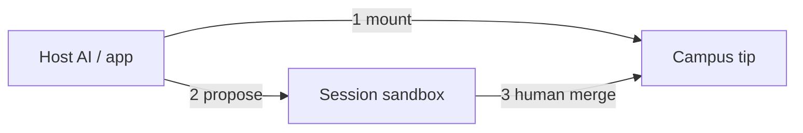
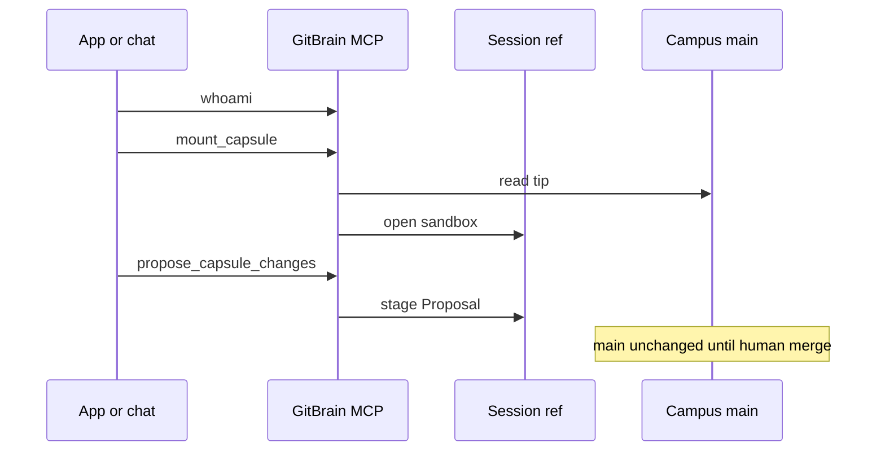

# 00 — Picture of GitBrain

**One topic:** how knowledge moves. Visuals complement the rules below.

## Delivery diagram (custody of a change)

Stacked responsibility (Incoterms-style, for bundles of docs):

| Until… | Custodian of the change | If this step fails |
|--------|-------------------------|-------------------|
| Mount returns | Campus (read-only tip) | Retry; check token/DNS |
| Propose returns | Session ref only | Fix files; propose again |
| Consensus receipt | Campus `main` | Human retries merge |

## Swimlane — one hop of work

## Rules under the diagram

1. Bearer host token out-of-band (`GB_TOKEN`). Never paste tokens into Campus docs or public prompts.
2. One session per task. Keep `session_id`.
3. Writes = propose only. No agent commit.
4. Graph is a **projection** of OKF/git objects — not a second database of truth.
5. ChatGPT / Claude / Grok Memory ≠ GitBrain SoT.
