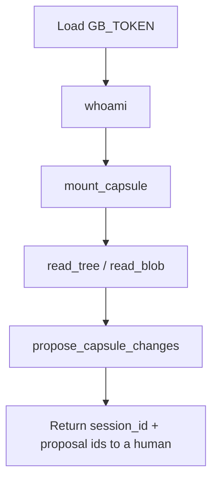

# 02 — Programmatic access

**One topic:** call GitBrain from code.



## Pick a stack

| Stack | Folder | Notes |
|-------|--------|-------|
| curl | [examples/curl](../examples/curl) | Fastest smoke |
| Python | [examples/python](../examples/python) | `httpx`, no SDK lock-in |
| TypeScript | [examples/typescript](../examples/typescript) | Node 20+, `fetch` |
| Go | [examples/go](../examples/go) | Stdlib `net/http` |

All four speak **MCP JSON-RPC** to `GB_MCP_URL` (default `https://mcp.gitbrain.com/mcp`) with `Authorization: Bearer $GB_TOKEN`.

Mint `GB_TOKEN` at `https://app.gitbrain.com/dashboard` or `https://app.gitbrain.com/authorize-agent`. Dashboard tokens are prefixed `gb_live_…`. Never put the token in a prompt.

## Minimal contract

```text
Authorization: Bearer $GB_TOKEN
Content-Type: application/json

POST { whoami | tools/call mount_capsule | read_tree | read_blob | propose_capsule_changes }
```

This adopt kit standardizes on MCP (`https://mcp.gitbrain.com/mcp`) so every host looks the same.
