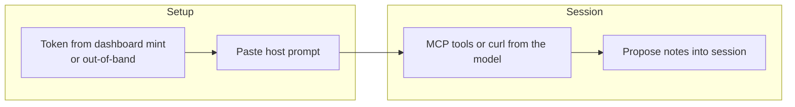

# 03 — Conversational access (chat & voice)

**One topic:** give Claude, ChatGPT, or Grok a GitBrain session without writing an app.

**Preferred token source:** sign up on the site and mint an agent token ([05-signup-e2e](05-signup-e2e.md)). Keep the token in the host secret store, not the prompt.

## Host cards

| Host | Chat | Voice | Prompt file |
|------|------|-------|-------------|
| Claude | Projects / Claude.ai + MCP or paste bootstrap | Voice → same system rules | [prompts/claude.md](../prompts/claude.md) |
| ChatGPT | Custom GPT Actions **or** paste bootstrap + browse/curl | Voice mode: keep replies short; same SoT rules | [prompts/chatgpt.md](../prompts/chatgpt.md) |
| Grok | Paste bootstrap; use MCP if available | Voice: confirm whoami aloud, then mount | [prompts/grok.md](../prompts/grok.md) |

Shared voice addendum: [prompts/voice.md](../prompts/voice.md).

## Swimlane — conversational hop

| Actor | Does |
|-------|------|
| You | Mint token in dashboard (or out-of-band); paste prompt; say the task |
| Host model | whoami → mount → read → propose |
| You (human) | Merge on Campus if the proposal should land |

## If DNS fails before HTTP

Report `blocked_before_session_creation` and stop. Do **not** invent Campus contents from chat memory.
