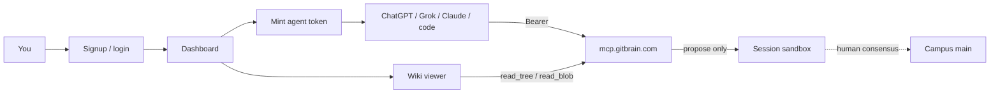

# 05 — Signup path & end-to-end flow

**One topic:** create an account, mint an agent token, use it from ChatGPT/Grok/Claude (or code), then review knowledge on the GitBrain site.

> Status: this is the **product contract**. Site signup/dashboard routes ship when the app Worker is deployed; until then tokens may still be issued out-of-band. Do not claim the dashboard is live unless `https://app.gitbrain.com` (or the chosen host) returns the login UI.

## Picture



## Swimlane

| Step | Actor | Does |
|------|--------|------|
| 1 | You | Open signup/login on the GitBrain site |
| 2 | You | In dashboard → **Tokens** → mint an agent/host token (shown once) |
| 3 | You | Paste token into GPT secret / Claude MCP / `.env` as `GB_TOKEN` — never into the prompt body |
| 4 | Agent | `whoami` → `mount_capsule` → read → `propose_capsule_changes` |
| 5 | You | Open wiki viewer / sessions; confirm proposals; merge Campus only if you intend to |

## URLs (target)

| Surface | URL |
|---------|-----|
| Site login / signup | `https://app.gitbrain.com` (signup/login) |
| Dashboard | `https://app.gitbrain.com` |
| Wiki / capsules | `https://app.gitbrain.com/c/<slug>` |
| Authorize agent (copy token) | `https://app.gitbrain.com/oauth/agent/authorize` |
| MCP | `https://mcp.gitbrain.com/mcp` |
| Health | `https://mcp.gitbrain.com/health` |

## Programmatic after signup

Same as [02-programmatic](02-programmatic.md): set `GB_TOKEN` from the dashboard mint, then run any [example](../examples/).

```bash
cp .env.example .env   # set GB_TOKEN from dashboard
# python examples/python/hello_gitbrain.py
```

## Conversational after signup

1. Mint token in dashboard (or authorize-agent page).
2. Store it in the host secret store (Custom GPT Actions auth, Claude MCP config, etc.).
3. Paste the host prompt from [prompts/](../prompts/) — **no token in the prompt**.
4. Ask the model to `whoami`, mount, propose a tiny note.
5. Refresh the site wiki/sessions; request human merge only if Campus should change.

## Safety cells

| Claim | Allowed? |
|-------|----------|
| “I signed up and minted a token” | Yes, if dashboard did |
| “Agent proposed into my session” | Yes, with `session_id` + proposal ids |
| “Campus/main is updated” | Only after human/admin consensus merge |
| Token inside chat prompt | **No** |
