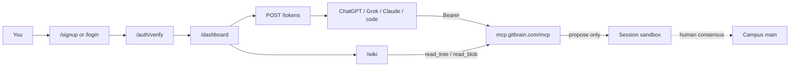

# 05 — Signup path & end-to-end flow

**One topic:** create an account on the human app, mint an agent token, use it from ChatGPT/Grok/Claude (or code), then review knowledge on the wiki.

> Live hosts: human app `https://app.gitbrain.com` · MCP `https://mcp.gitbrain.com` · marketing-only `https://gitbrain.com` (not signup).

## Picture



## Swimlane

| Step | Actor | Does |
|------|--------|------|
| 1 | You | Open `https://app.gitbrain.com/signup` or `/login` |
| 2 | App | `POST /auth/magic-link` with `email` + `intent=signup` or `intent=login` |
| 3 | You | Until Resend is configured, the check-email page shows a **demo / local verify link** — open it. After Resend is live, use the mailed link instead. Both hit `GET /auth/verify?token=…` |
| 4 | You | On `/dashboard` (or `/authorize-agent`) mint a token via `POST /tokens`. Secret is shown **once**. Dashboard tokens are prefixed `gb_live_…`. Ops host/service tokens are a separate class |
| 5 | You | Paste the token into the host secret store / `.env` as `GB_TOKEN` — **never** into the prompt body |
| 6 | Agent | `whoami` → `mount_capsule` → `read_tree` / `read_blob` → `propose_capsule_changes` against `https://mcp.gitbrain.com/mcp` |
| 7 | You | Open `/wiki` or `/wiki/getting-started` (auth). Wiki may show **Demo mode** until `MCP_SERVICE_TOKEN` is set on the app Worker. Merge Campus only if you intend to |

## URLs (live)

| Surface | URL | Notes |
|---------|-----|-------|
| Human app home | `https://app.gitbrain.com/` | 200 |
| Sign up | `https://app.gitbrain.com/signup` | Magic-link form; `intent=signup` |
| Log in | `https://app.gitbrain.com/login` | Magic-link form; `intent=login` |
| Verify | `https://app.gitbrain.com/auth/verify?token=…` | Completes the magic link |
| Dashboard | `https://app.gitbrain.com/dashboard` | Auth; 303 → `/login` if signed out |
| Mint token | `POST https://app.gitbrain.com/tokens` | Auth; secret shown once |
| Authorize agent | `https://app.gitbrain.com/authorize-agent` | Auth; copy token for a host |
| Wiki | `https://app.gitbrain.com/wiki` | Auth; may be Demo mode |
| Wiki: getting started | `https://app.gitbrain.com/wiki/getting-started` | Auth; may be Demo mode |
| MCP | `https://mcp.gitbrain.com/mcp` | `Authorization: Bearer <token>` |
| Health | `https://mcp.gitbrain.com/health` | 200 |

Signup is only on the human app (`app.gitbrain.com`), not the marketing site (`gitbrain.com`).

## Email caveat (Resend)

Until Resend is configured on the app Worker, **no mail is sent**. The check-email page states that email delivery is not configured and prints a **demo / local verify link**. Open that link to finish signup or login. After Resend is configured, the same page waits on the inbox instead.

## Tokens

| Kind | Where minted | Prefix / use |
|------|----------------|--------------|
| Dashboard / authorize-agent | `https://app.gitbrain.com/dashboard` or `/authorize-agent` | `gb_live_…` — paste into the host secret store as `GB_TOKEN` |
| Host / service (ops) | Issued out-of-band | Separate class — not the dashboard mint |

Never put a token in a chat prompt, Campus doc, or this kit.

## Programmatic after signup

Same as [02-programmatic](02-programmatic.md): set `GB_TOKEN` from the dashboard (or authorize-agent) mint, then run any [example](../examples/).

```bash
cp .env.example .env   # set GB_TOKEN from https://app.gitbrain.com/dashboard
# python examples/python/hello_gitbrain.py
```

## Conversational after signup

1. Mint token at `/dashboard` or `/authorize-agent`.
2. Store it in the host secret store as `GB_TOKEN` (Custom GPT Actions auth, Claude MCP config, etc.).
3. Paste the host prompt from [prompts/](../prompts/) — **no token in the prompt**.
4. Ask the model to `whoami`, mount, propose a tiny note.
5. Refresh `/wiki`; request human merge only if Campus should change.

## Safety cells

| Claim | Allowed? |
|-------|----------|
| “I signed up at app.gitbrain.com and minted a `gb_live_…` token” | Yes, if dashboard / authorize-agent did |
| “I used the demo verify link because email is not sending yet” | Yes, until Resend is configured |
| “Agent proposed into my session” | Yes, with `session_id` + proposal ids |
| “Campus/main is updated” | Only after human/admin consensus merge |
| Token inside chat prompt | **No** |
| Signup on `https://gitbrain.com` | **No** — marketing only |
