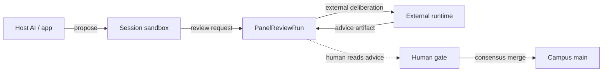

# 06 — Persistent panels (research)

**One topic:** what GitBrain should own if panels review Proposals — and what it must not own.

> **Research / planning only.** This note captures architecture research. It is **not** a product implementation, schema migration, MCP tool, or UI change. Do not treat a stored panel result as Campus publish authority.

## Recommendation

GitBrain owns three things. External runtimes own deliberation.

| Surface | Owner | Does |
|---------|-------|------|
| **Panel registry** | GitBrain | Typed panel Capsules (template + version) that can be mounted like any other Capsule |
| **Review-run persistence** | GitBrain | `PanelReviewRun` records bound to an **exact Proposal revision** |
| **Human gate** | GitBrain | Consensus merge to Campus `main` — same rule as today |
| **Deliberation** | External runtime | Council / design-advisory reasoning; posts a result back |



Stacked responsibility:

| Until… | Custodian | If this step fails |
|--------|-----------|-------------------|
| Propose returns | Session ref only | Fix files; propose again |
| Panel review completes | `PanelReviewRun` (advice) | Record **failed** — do **not** treat as approval |
| Consensus receipt | Campus `main` | Human retries merge |

## Smallest addition

Do **not** add a Worker orchestrator, multi-provider router, or in-process council.

The smallest durable addition is two typed records:

1. **Panel Capsule** — a versioned mount that declares panel type (`council` or `design-advisory`), output contract, and runner hint (external). Same Capsule rules as [01-terms](01-terms.md): mount an exact version.
2. **`PanelReviewRun`** — one review of one Proposal revision. Link `proposal_id` + the exact revision (git object / session tip). Store status, runner identity, and the advice artifact. A later Proposal edit is a **new** run, not an overwrite.

Research shape (not implemented):

```text
PanelCapsule
  type: council | design-advisory
  contract_version: string
  runner: external

PanelReviewRun
  panel_capsule_id + panel_version
  proposal_id + proposal_revision
  status: requested | running | completed | failed
  advice: artifact  # never a merge receipt
```

No GitBrain Worker schedules seats, fans out providers, or synthesizes dissent. The runtime that already has models does that work and writes the run back.

## Gap (today)

| Layer | Has | Missing |
|-------|-----|---------|
| **App** (`app.gitbrain.com`) | Auth, token mint, wiki viewer | Panel types, proposal inbox UI, review-run viewer |
| **Session** (MCP) | `propose_capsule_changes`, human consensus merge | Panel registry, `PanelReviewRun`, review tools |
| **Signup e2e** | [05-signup-e2e](05-signup-e2e.md) path | Must stay unblocked by this research |

Live MCP tools remain `whoami`, `mount_capsule`, `read_tree`, `read_blob`, `propose_capsule_changes`. There is no panel tool and no inbox route on the app Worker.

## Two templates

Only these two panel types are in scope for the first registry.

### 1. Council of High Intelligence

External runner. GitBrain stores the run; it does not host the council.

- Deliberation stays outside GitBrain (existing council hosts / CLIs).
- **Retain dissent.** A completed run must keep split tallies, minority reports, and unresolved questions. Do not collapse them into a fake consensus.
- A recommendation in the verdict is still **advice**. Campus does not move.

### 2. Design Advisory Panel

Locked **seven-section** output. Do not add, remove, or rename sections. Empty sections are `N/A — {reason}`.

| # | Section |
|---|---------|
| 1 | Case brief |
| 2 | Constraints |
| 3 | Options considered |
| 4 | Recommendation |
| 5 | Tradeoffs |
| 6 | Risks |
| 7 | Open questions |

**Fresh-case default.** Each run starts from the current Proposal revision and the mounted panel Capsule only. Prior panel chat, prior runs, and vendor Memory are out of scope unless a human explicitly attaches them as evidence on that revision.

## Roadmap

| Priority | What | When |
|----------|------|------|
| **P0** | Schema sketch + this research note | Now. Does **not** block signup e2e ([05](05-signup-e2e.md)) |
| **P1** | Proposal inbox UI, then review-run UI + optional MCP read/write for runs | After an inbox exists so humans can see Proposals |
| **Later** | Multi-provider hosting / in-Worker orchestration | **Deferred.** External runtimes keep deliberation |

P0 in this kit is documentation only. Implementing tables or tools belongs in the app / MCP repos, after the inbox.

## Authority cells

| Claim | Allowed? |
|-------|----------|
| Panel advice is publish authority | **No** |
| Failed or incomplete review is approval | **No** |
| Agent merges Campus after a “pass” | **No** |
| Human merges after reading advice | **Yes** — same consensus gate as today |
| Vendor Memory as the panel record | **No** — persist `PanelReviewRun` |
| Signup e2e blocked on panels | **No** |

Panel advice ≠ publish authority. Failed review ≠ approval.
